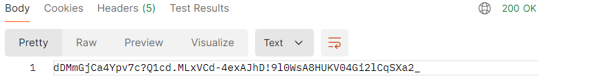

### Um API que retorna uma senha gerada aleatoriamente com base no tamanho mínimo de 20 e no máximo 60 caracteres escolhido pelo usuário através da URL.

### Rodando o projeto, você pode usar o método GET no link localhost:8080/{tamanho}. Esse tamanho corresponde ao tamanho que a senha terá. O retorno será a senha gerada no formato de uma string.

  

## Veja abaixo um exemplo de retorno de uma senha gerada com 60 digitos

